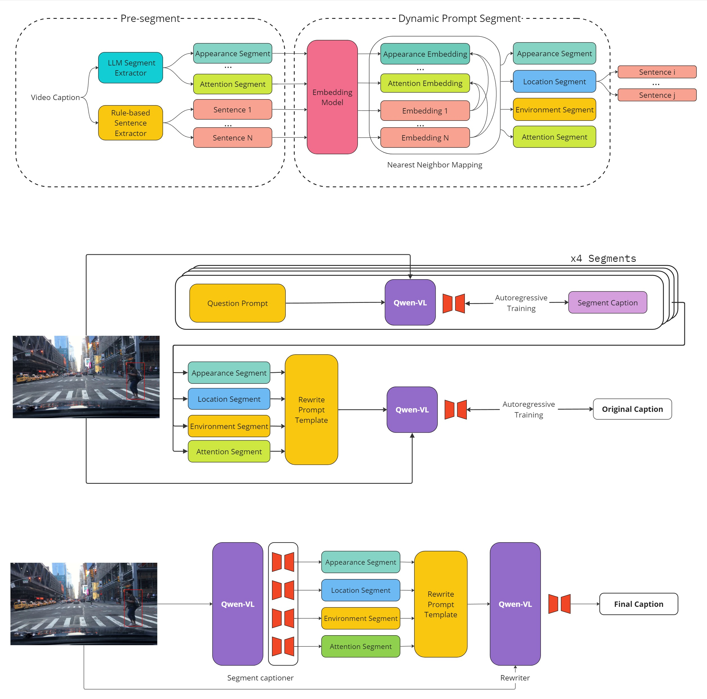

# AICITY2024 Track 2 - Code from AIO_ISC Team

The 2nd Place Solution to The 8th NVIDIA AI City Challenge (2024) Track 2
<p align="center">
    
</p>

---
## Results

| **Rank**            |       **Team ID**       |         **Team name**          |             **MRR Score**              |
|:--------------------:|:-----------------------------:|:----------------------------:|:---------------------------------:|
| 1 |   208   |   AliOpenTrek   |   33.4308    |
| **2** |   **28**  | **AIO_ISC (Ours)** |   **32.8877**   |
| 3 |   68  |      Lighthouse       |   32.3006    |
| 4 |   87 |    VAI     |   32.2778    |
| 5 |   184  |    Santa Claude	    |   29.7838    |

---

## Structure
### Code Structure
```
├── src
│   ├── preprocess
│   |   ├── extract_frames
│   |   ├── segment_extraction
│   ├── train
│   |   ├── Qwen-VL
│   |   ├── prepare_train_data
│   ├── inference
│   ├── postprocess
│   ├── evaluation
├── tools
├── aux_dataset
│   ├── results
│   ├── submission
│   ├── train_data
│   ├── extracted_frames
│   ├── segmentation_data
├── dataset
```

### Data Structure
Please download [WTS dataset](https://github.com/woven-visionai/wts-dataset) and set up the dataset as follow:
```
├── dataset
│   ├── annotations
│   |   ├── bbox_annotated
│   |   |   ├── pedestrian
│   |   |   |   ├── train
│   |   |   |   ├── val
│   |   |   |   ├── test
│   |   |   ├── vehicle
│   |   ├── bbox_generated
│   |   |   ├── ... (same structure)
│   |   ├── caption
│   |   |   |   ├── train
│   |   |   |   ├── val
│   |   |   |   ├── test
│   |   videos
│   |   |   ├── train
│   |   |   ├── val
│   |   |   ├── test
│   |   external
│   |   |   ├── BDD_PC_5K
│   |   |   |   ├── ... (same structure)
```

## Environment
```
pip install -r requirements.txt
```

## Prepare
### Preprocessing
Extracting video frames:
```
sh tools/extract_frames.sh
```

Segment Extraction:
```
Updating
```

### Training
Prepare train data:
```
sh tools/prepare_train_data.sh
```

Training:
Set the correct train and eval data path and run the code in [here](src/train/Qwen-VL/finetune/finetune_lora_single_gpu.sh).

### Inference
Inference trained model on test set:
```
sh tools/inference.sh
```
The pretrained checkpoints are listed in [here](src/inference/ckpt.json). 

### Postprocessing
```
sh tools/postprocess.sh
```

### Evaluation
We follow [wts-dataset repo](https://github.com/woven-visionai/wts-dataset) and reimplement the fast version at [here](src/evaluation/metrics.py).